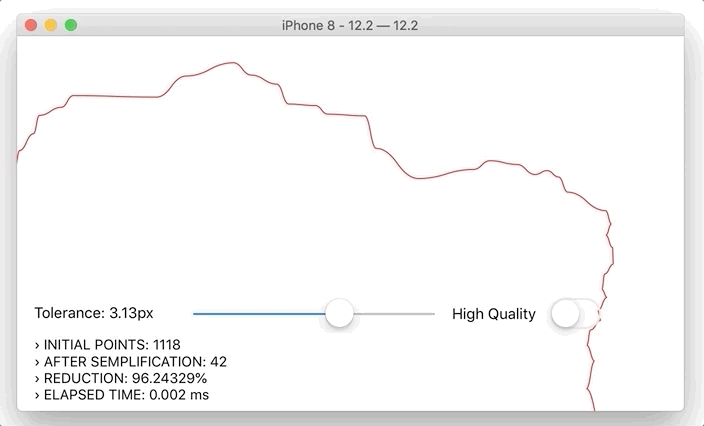

<p align="center" >
  
</p>

<p align="center"><strong>High-performance polyline simplification library</strong></p>

SwiftSimplify is a tiny high-performance Swift polyline simplification library ported from Javascript's [Simplify.js](http://mourner.github.io/simplify-js/). Original work come from [Leaflet](http://leafletjs.com/), a JS interactive maps library by [Vladimir Agafonkin](http://agafonkin.com/en).

It uses a combination of [Douglas-Peucker](http://en.wikipedia.org/wiki/Ramer-Douglas-Peucker_algorithm) and Radial Distance algorithms. Works both on browser and server platforms.

Polyline simplification dramatically reduces the number of points in a polyline while retaining its shape, giving a huge performance boost when processing it and also reducing visual noise. For example, it's essential when rendering a 70k-points line chart or a map route in the browser using MapKit.


  
## Requirements
* iOS 8.0, watchOS 2.0, tvOS 9.0
* Swift 5.x+

## Communication
- If you **found a bug**, open an issue.
- If you **have a feature request**, open an issue.
- If you **want to contribute**, submit a pull request.

## Installation
SwiftSimplify is available through [CocoaPods](http://cocoapods.org). To install
it, simply add the following line to your Podfile:

```ruby
pod "SwiftSimplify"
```
## Usage
Usage is pretty straightforward: in fact you need just call the SwiftSimplify's class method simplify by passing your configuration:

```swift
let allPoints: [Point2DRepresentable] = ...
let simplifiedPoints = SwiftSimplify.simplify(allPoints, tolerance: tolerance)
```

Allowed parameters are:

* ```points```: An array of points. SwiftSimplify supports Swift's generic so you can pass an array of objects which are conforms to `Point2DRepresentable` protocol (both `CGPoint` and `CLLocationCoordinate2D` objects supports it).
* ```tolerance```: *(1 by default)* Affects the amount of simplification (in the same metric as the point coordinates)
* ```highQuality```: *(false by default)* Excludes distance-based preprocessing step which leads to highest quality simplification but runs ~10-20 times slower.

## ❤️ Your Support

*Hi fellow developer!*  
You know, maintaing and developing tools consumes resources and time. While I enjoy making them **your support is foundamental to allow me continue its development**.  

If you are using SwiftSimplify or any other of my creations please consider the following options:

- [**Make a donation with PayPal**](https://www.paypal.com/paypalme/danielemargutti/20)
- [**Become a Sponsor**](https://github.com/sponsors/malcommac)

- [Follow Me](https://github.com/malcommac)

### Installation

SwiftSimplify is compatible with Swift 5.x+ under iOS (11+) and macOS platforms.  

You can install it via CocoaPods:

```sh
use_frameworks!
pod 'SwiftSimplify'
```

or SPM in your `Package.swift`:

```sh
import PackageDescription

  let package = Package(name: "YourPackage",
    dependencies: [
      .Package(url: "https://github.com/malcommac/SwiftSimplify.git", majorVersion: 0),
    ]
  )
```

**Consider ❤️ [support the development](#support) of this library!**

## Contributing

- If you **need help** or you'd like to **ask a general question**, open an issue.
- If you **found a bug**, open an issue.
- If you **have a feature request**, open an issue.
- If you **want to contribute**, submit a pull request.

## Copyright & Acknowledgements

SwiftSimplify is currently owned and maintained by Daniele Margutti.  
You can follow me on Twitter [@danielemargutti](http://twitter.com/danielemargutti).  
My web site is [https://www.danielemargutti.com](https://www.danielemargutti.com) 

This software is licensed under [MIT License](LICENSE.md).

***Follow me on:***  
- 💼 [Linkedin](https://www.linkedin.com/in/danielemargutti/)  
- 🐦 [Twitter](https://twitter.com/danielemargutti)
