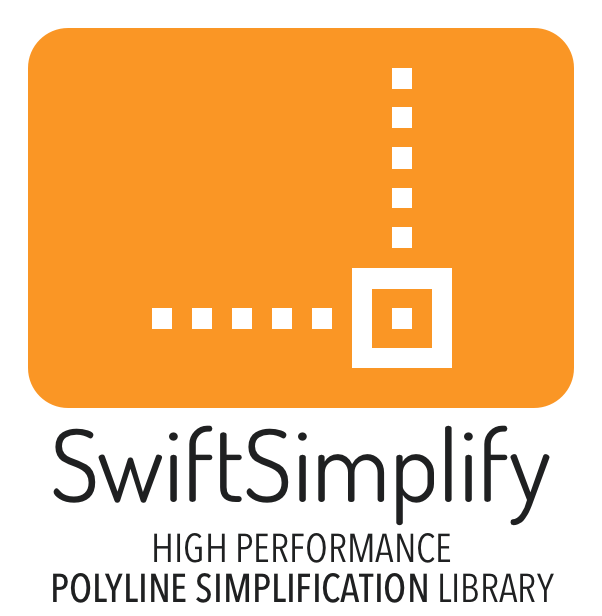

<p align="center" >

</p>

[](https://travis-ci.org/daniele margutti/SwiftSimplify)
[](http://cocoapods.org/pods/SwiftSimplify)
[](http://cocoapods.org/pods/SwiftSimplify)
[](http://cocoapods.org/pods/SwiftSimplify)

<p align="center" >★★ <b>Star our github repository to help us!</b> ★★</p>

# SwiftSimplify
SwiftSimplify is a tiny high-performance Swift polyline simplification library ported from Javascript's [Simplify.js](http://mourner.github.io/simplify-js/). Original work come from [Leaflet](http://leafletjs.com/), a JS interactive maps library by [Vladimir Agafonkin](http://agafonkin.com/en).
It uses a combination of [Douglas-Peucker](http://en.wikipedia.org/wiki/Ramer-Douglas-Peucker_algorithm) and Radial Distance algorithms. Works both on browser and server platforms.

Polyline simplification dramatically reduces the number of points in a polyline while retaining its shape, giving a huge performance boost when processing it and also reducing visual noise. For example, it's essential when rendering a 70k-points line chart or a map route in the browser using MapKit.


  
## Requirements
* iOS 8.0, macOS 10.9, watchOS 2.0, tvOS 9.0
* Swift 5.x+

## Communication
- If you **found a bug**, open an issue.
- If you **have a feature request**, open an issue.
- If you **want to contribute**, submit a pull request.

## Installation
SwiftSimplify is available through [CocoaPods](http://cocoapods.org). To install
it, simply add the following line to your Podfile:

```ruby
pod "SwiftSimplify"
```
## Usage
Usage is pretty straightforward: in fact you need just call the SwiftSimplify's class method simplify by passing your configuration:

```swift
let allPoints: [Point2DRepresentable] = ...
let simplifiedPoints = SwiftSimplify.simplify(allPoints, tolerance: tolerance)
```

Allowed parameters are:

* ```points```: An array of points. SwiftSimplify supports Swift's generic so you can pass an array of objects which are conforms to `Point2DRepresentable` protocol (both `CGPoint` and `CLLocationCoordinate2D` objects supports it).
* ```tolerance```: *(1 by default)* Affects the amount of simplification (in the same metric as the point coordinates)
* ```highQuality```: *(false by default)* Excludes distance-based preprocessing step which leads to highest quality simplification but runs ~10-20 times slower.

## Author

Daniele Margutti, [me@danielemargutti.com](mailto:me@danielemargutti)

You can reach me on twitter [@danielemargutti](http://www.twitter.com/danielemargutti). 

My web site is [danielemargutti.com](http://www.danielemargutti.com)

## License

SwiftSimplify is available under the MIT license. See the LICENSE file for more info.
